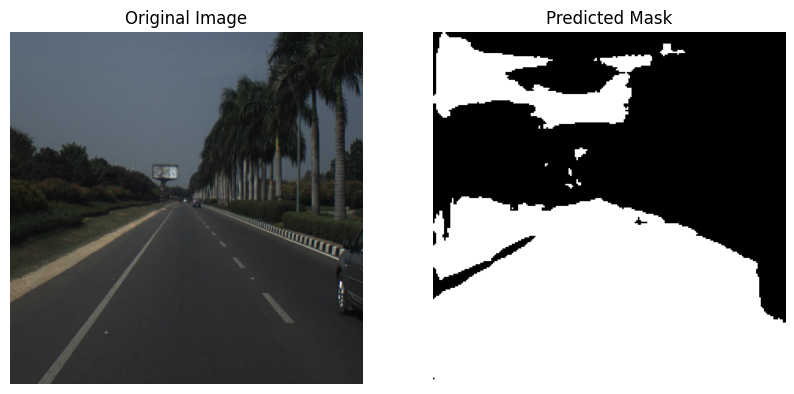
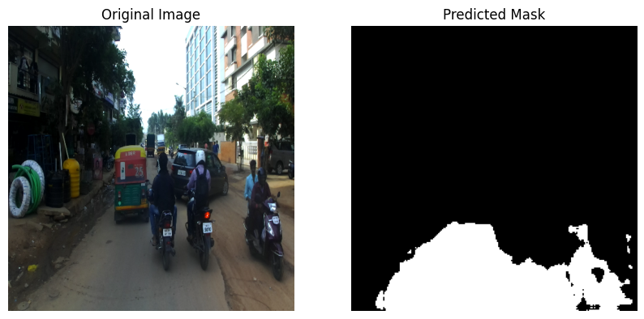
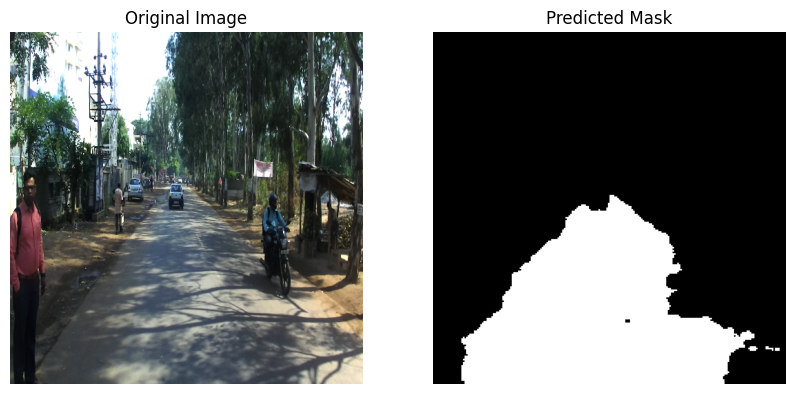
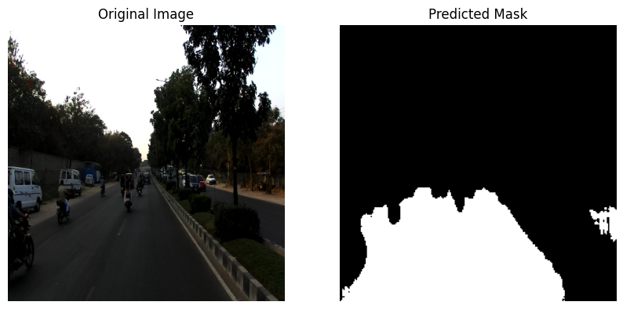
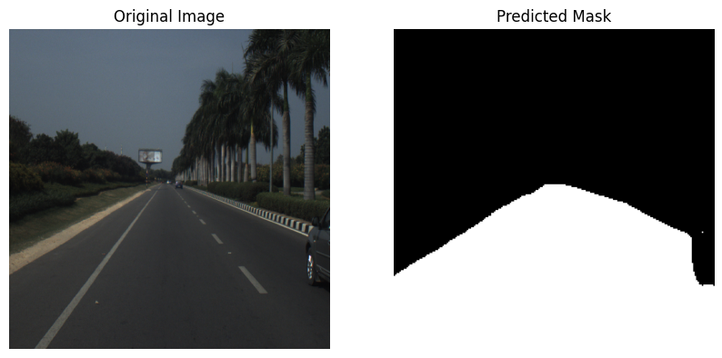
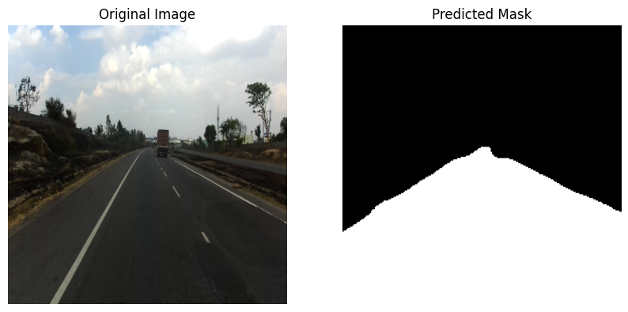
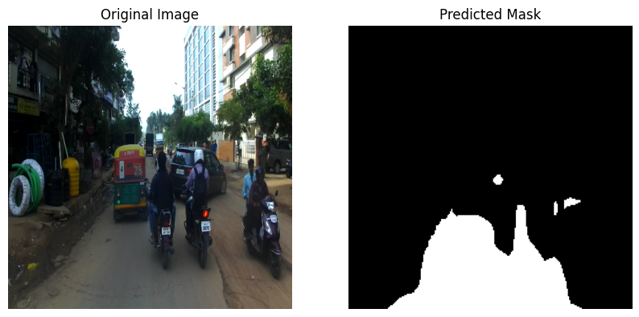
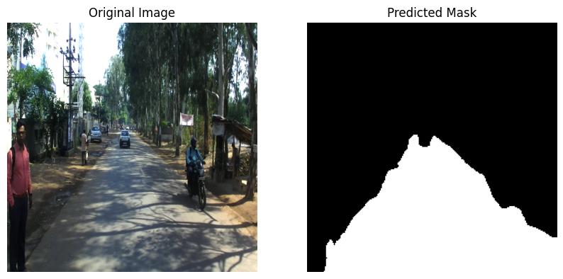
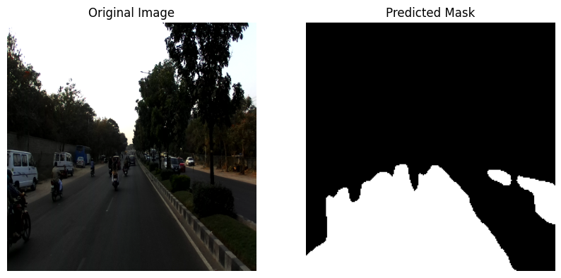

# Road Segmentation using U-Net and DeepLabV3+ on IDD Dataset

This project applies binary semantic segmentation on the **IDD (Indian Driving Dataset)** to detect road regions in real-world driving conditions. The pipeline involves training and evaluating both **vanilla U-Net** and **DeepLabV3+** architectures using PyTorch.

## 📈 Results

### Sample U-Net Outputs:

### Sample DeepLabV3+ baced U-Net Outputs:

### Comparison of Metrics:

| Model        | IoU (%) | Dice Score (%) |
|--------------|---------|----------------|
| U-Net        | 74.04   | 84.24          |
| DeepLabV3+   | 87.40   | 93.15          |

##  Models Used

- **U-Net**: A simple encoder–decoder architecture used as the baseline.
- **DeepLabV3+**: Enhanced segmentation model with atrous convolutions and a ResNet backbone, significantly improving accuracy.

##  Features

- Custom `Dataset` class for loading and preprocessing IDD images and masks
- Road mask generation pipeline
- Visualization utilities for inspecting predictions
- Training and evaluation loops
- Data augmentations to handle:
  - Lighting variation
  - Weather changes
  - Road textures and occlusions

### Acknowledgements
- [IDD Dataset](https://idd.insaan.iiit.ac.in/)
- [U-Net](https://arxiv.org/abs/1505.04597)
- [DeepLabV3+](https://arxiv.org/abs/1802.02611)

